# 🚲 Bikes — Automação, Observabilidade e Esteira DevSecOps

[](https://github.com/wlli173/bikes/actions/workflows/ci-cd.yml)

API REST de usuários em **Spring Boot 4.1.1 / Java 25** (baseada no projeto da disciplina [fabiojrp/bikes-2026.2](https://github.com/fabiojrp/bikes-2026.2)), conteinerizada com **Dockerfile Multistage**, publicada por uma **esteira CI/CD no GitHub Actions** e acompanhada por uma stack local completa de **métricas (Prometheus + Grafana)** e **logs centralizados (Graylog + OpenSearch + MongoDB)** — tudo sobe com um único comando.

```bash
docker compose up --build
```

---

## Sumário

1. [Arquitetura](#-arquitetura)
2. [Como executar](#-como-executar)
3. [API da aplicação](#-api-da-aplicação)
4. [Dockerfile Multistage](#-dockerfile-multistage-requisito-eliminatório)
5. [Pipeline CI/CD](#-pipeline-cicd-github-actions)
6. [Monitoramento — Prometheus](#-monitoramento--prometheus)
7. [Observabilidade — Grafana](#-observabilidade--grafana)
8. [Logs centralizados — Graylog](#-logs-centralizados--graylog)
9. [Decisões técnicas](#-decisões-técnicas)
10. [Testes automatizados](#-testes-automatizados)
11. [Estrutura do repositório](#-estrutura-do-repositório)
12. [Mapeamento da rubrica](#-mapeamento-da-rubrica)
13. [Troubleshooting](#-troubleshooting)

---

## 🏗️ Arquitetura

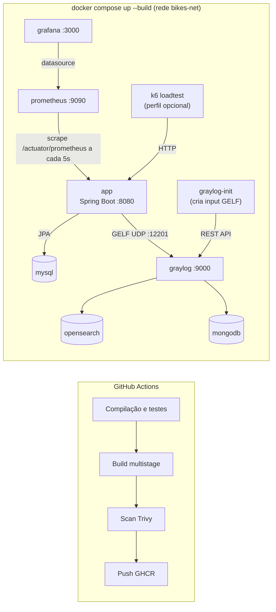

| Serviço | URL | Credenciais |
|---------|-----|-------------|
| **API Bikes** | http://localhost:8080/api/v1/usuarios | — |
| **Swagger UI** | http://localhost:8080/docs-bikes.html | — |
| **Actuator** | http://localhost:8080/actuator/health · `/actuator/prometheus` | — |
| **Prometheus** | http://localhost:9090/targets | — |
| **Grafana** | http://localhost:3000 → dashboard *Bikes — JVM & Spring Boot* | `admin` / `admin` (ou anônimo como Viewer) |
| **Graylog** | http://localhost:9000 | `admin` / `admin` |
| MySQL, MongoDB, OpenSearch | apenas rede interna | — |

Ordem de subida garantida por `depends_on` + `condition` e healthchecks reais:

```
mongodb ─┐
         ├─(healthy)─► graylog ─(healthy)─► graylog-init ─(completed)─┐
opensearch┘                                                          ├─► app ─► (loadtest)
mysql ─────────────────────────(healthy)─────────────────────────────┘
prometheus ─(healthy)─► grafana
```

---

## 🚀 Como executar

### Pré-requisitos

| Requisito | Mínimo |
|-----------|--------|
| Docker + Docker Compose V2 | Docker 24+ |
| Memória para o Docker | **6 GB** (recomendado 8 GB) |
| `vm.max_map_count` (Linux/WSL2) | 262144 — ver [Troubleshooting](#-troubleshooting) |

### 1. Subir a stack (comando único)

```bash
docker compose up --build
```

Nenhuma etapa manual é necessária: o input GELF do Graylog, o datasource e o dashboard do Grafana são provisionados automaticamente. A primeira execução baixa ~2,5 GB de imagens; com as imagens em cache, a stack inteira fica `healthy` em **~70 s**.

Para acompanhar em outro terminal:

```bash
docker compose ps
```

```
NAME               IMAGE                                 STATUS
bikes-app          bikes-app                             Up (healthy)
bikes-grafana      grafana/grafana:11.6.0                Up (healthy)
bikes-graylog      graylog/graylog:6.1.16                Up (healthy)
bikes-mongodb      mongo:6.0.20                          Up (healthy)
bikes-mysql        mysql:8.0.39                          Up (healthy)
bikes-opensearch   opensearchproject/opensearch:2.15.0   Up (healthy)
bikes-prometheus   prom/prometheus:v3.4.1                Up (healthy)
```

> `bikes-graylog-init` aparece como `Exited (0)` — é esperado: ele só cria o input GELF e termina.

### 2. Gerar tráfego (popular dashboards e logs)

```bash
docker compose --profile loadtest up loadtest
```

O script k6 ([loadtest/script.js](loadtest/script.js)) roda por 2 minutos (até 10 usuários virtuais) e exercita todos os cenários: `201`, `200`, `422` (validação), `404` e `500`, além de logs DEBUG/INFO/WARN/ERROR.

### 3. Parar e limpar

```bash
docker compose --profile loadtest down -v --remove-orphans
```

---

## 📘 API da aplicação

| Método | Rota | Descrição | Respostas |
|--------|------|-----------|-----------|
| `POST` | `/api/v1/usuarios` | Cria usuário (`username` = e-mail, `password` = 6 caracteres) | `201`, `422` |
| `GET` | `/api/v1/usuarios` | Lista usuários | `200` |
| `GET` | `/api/v1/usuarios/{id}` | Busca por id | `200`, `404` |
| `PATCH` | `/api/v1/usuarios/{id}` | Atualiza a senha | `200`, `404` |
| `GET` | `/api/v1/demo/log` | Emite logs DEBUG/INFO/WARN/ERROR (evidência do Graylog) | `200` |
| `GET` | `/api/v1/demo/log/error` | Simula erro 500 | `500` |

Documentação interativa (SpringDoc/OpenAPI, vinda do projeto base): **http://localhost:8080/docs-bikes.html**

```bash
curl -X POST http://localhost:8080/api/v1/usuarios \
  -H "Content-Type: application/json" \
  -d '{"username":"ana@bikes.com","password":"123456"}'
```

Entradas inválidas retornam `422` com os erros por campo (`ApiExceptionHandler`):

```json
{"errors":{"password":"tamanho deve ser entre 6 e 6","username":"O email deve ser válido"},
 "message":"Campo(s) inválido(s)","method":"POST","path":"/api/v1/usuarios",
 "status":422,"statusMessage":"Unprocessable Content"}
```

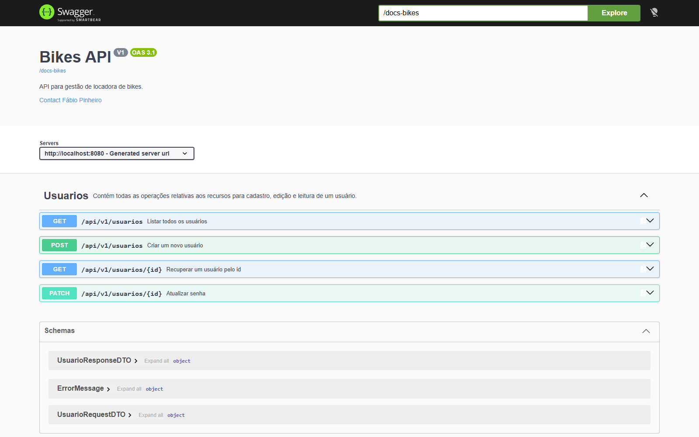

---

## 🐳 Dockerfile Multistage (requisito eliminatório)

[Dockerfile](Dockerfile):

| Estágio | Imagem base | Conteúdo |
|---------|-------------|----------|
| **1 — build** | `maven:3.9.16-eclipse-temurin-25-alpine` | JDK + Maven; resolve dependências (camada cacheada pelo `pom.xml`) e gera o `.jar` |
| **2 — runtime** | `eclipse-temurin:25-jre-alpine` | **Apenas JRE** + `app.jar` copiado do estágio 1 (`COPY --from=build`) |

Verificação na imagem final (`bikes-app`):

```text
$ docker run --rm --entrypoint sh bikes-app -c 'command -v javac; command -v mvn; ls /app; id'
javac: ausente
mvn: ausente
app.jar
uid=100(spring) gid=101(spring)
```

- Sem JDK, sem Maven, sem código-fonte e sem o repositório `~/.m2` na imagem de produção — só o JRE (~190 MB) e o JAR (~64 MB).
- Executa como usuário **não-root** (`spring`), com `TZ=America/Sao_Paulo` e `-XX:MaxRAMPercentage=75` (heap respeita o limite de memória do container).
- A própria esteira de CI **falha** se `javac` ou `mvn` aparecerem na imagem final (passo *Verificar runtime enxuto*).

---

## 🔁 Pipeline CI/CD (GitHub Actions)

[.github/workflows/ci-cd.yml](.github/workflows/ci-cd.yml) — disparada automaticamente em **push** e **pull request** para `main`/`master` (e manualmente via `workflow_dispatch`).

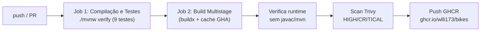

| Etapa | Detalhe |
|-------|---------|
| **Compilação e testes** | Java 25 (Temurin) com cache Maven; `./mvnw -B verify`; resumo dos testes no *job summary* e relatórios Surefire como artefato |
| **Build da imagem** | `docker/build-push-action` com o Dockerfile multistage e cache `type=gha` (a imagem é construída **uma única vez**) |
| **Segurança** | Verificação de runtime enxuto + scan de vulnerabilidades com **Trivy** (relatório no *job summary* e como artefato) |
| **Publicação** | Push para o **GitHub Container Registry**: `sha-<commit>`, `latest` (branch padrão) e `pr-<n>` (PRs internos). PRs de forks fazem build + scan, sem push |

Práticas DevSecOps aplicadas na esteira:
- **Menor privilégio**: `permissions: contents: read` global; só o job de imagem recebe `packages: write`.
- **Actions fixadas por SHA de commit** (com a versão em comentário) — protege contra tags reescritas em ataques de supply chain.
- `concurrency` cancela execuções obsoletas da mesma branch/PR.
- Autenticação no GHCR com o `GITHUB_TOKEN` efêmero (nenhum segredo manual).

> Existe também uma esteira equivalente para GitLab em [.gitlab-ci.yml](.gitlab-ci.yml).

### Evidências


---

## 📈 Monitoramento — Prometheus

- A aplicação usa **Spring Boot Actuator + Micrometer** (`micrometer-registry-prometheus`) e expõe `/actuator/prometheus` ([application.properties](src/main/resources/application.properties)).
- Histograma de latência habilitado (`percentiles-histogram.http.server.requests=true`) para calcular p95 no Prometheus.
- [prometheus/prometheus.yml](prometheus/prometheus.yml) faz o scrape de `app:8080/actuator/prometheus` **a cada 5 s** (job `bikes-app`).

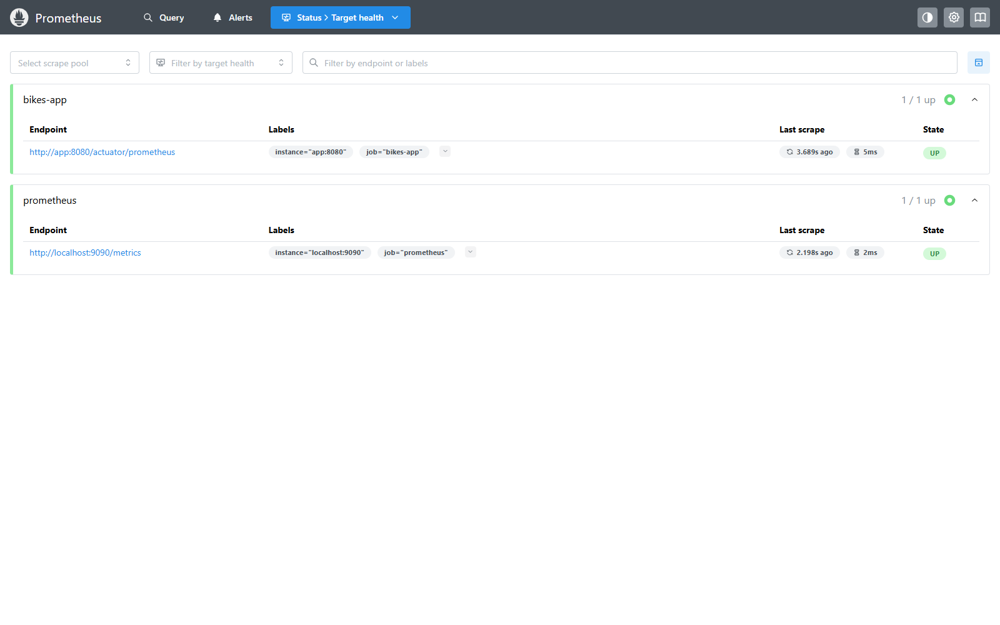

---

## 📊 Observabilidade — Grafana

Datasource e dashboard provisionados como código em [grafana/provisioning/](grafana/provisioning/) — nada é configurado manualmente. Dashboard **"Bikes — JVM & Spring Boot"** (21 painéis, atualização a cada 10 s):

| Seção | Painéis | Requisito do enunciado |
|-------|---------|------------------------|
| Visão geral | RPS total, taxa de erro 5xx, latência p95, uptime | — |
| JVM e sistema | **Memória Heap** (usado / committed / máximo), **Uso de CPU** (processo e container) | Heap da JVM · CPU |
| Tráfego HTTP | **RPS por classe de status (2xx/4xx/5xx)**, RPS por endpoint, **contagem por classe e por status code** | RPS · contagem por status |
| Tempo de resposta | **Tempo médio e p95 por classe de status**, p95 por endpoint | tempo de resposta por status |
| Runtime e logs | Threads, pausas de GC, eventos de log por nível (Logback) | — |

As consultas excluem `/actuator/*` para que o scrape do Prometheus e os healthchecks não poluam as métricas de negócio.

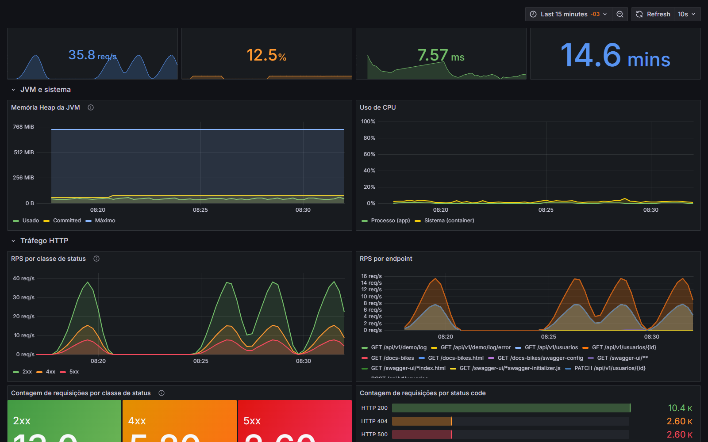
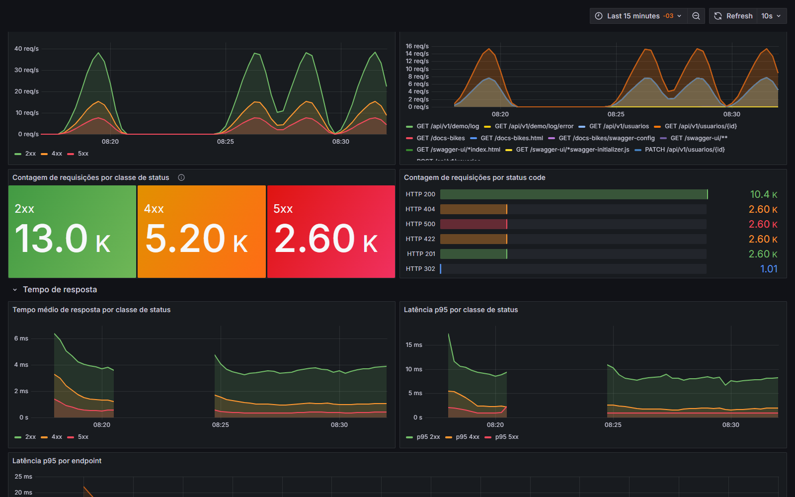
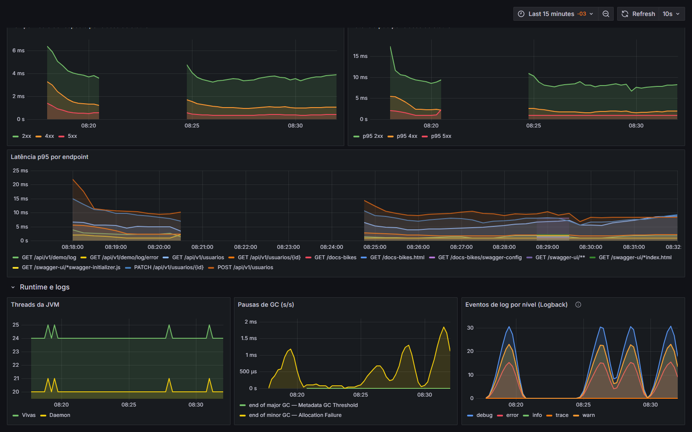
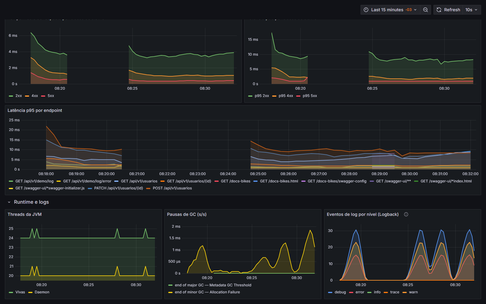

---

## 🪵 Logs centralizados — Graylog

- **Stack**: Graylog 6.1 + OpenSearch 2.15 + MongoDB 6.0.
- **Envio**: appender GELF UDP no Logback ([logback-spring.xml](src/main/resources/logback-spring.xml)) usando `de.siegmar:logback-gelf`, com os logs também no console.
- **Input automático**: o container `graylog-init` executa [graylog/init-gelf-input.sh](graylog/init-gelf-input.sh), que cria o input *GELF UDP* via API REST de forma **idempotente**; a app só sobe depois (`service_completed_successfully`), então nenhum log inicial se perde.
- **Mensagens estruturadas** — campos pesquisáveis em cada mensagem:

| Campo | Exemplo |
|-------|---------|
| `source` | `bikes-app` |
| `level_name` | `DEBUG`, `INFO`, `WARN`, `ERROR` |
| `logger_name` | `br.edu.ifc.bikes.service.UsuarioService` |
| `application` / `environment` | `bikes` / `docker` |
| `thread_name` | `http-nio-8080-exec-3` |
| `full_message` | mensagem completa, com stack trace quando houver exceção |

Consultas úteis no Graylog: `source:bikes-app AND level_name:ERROR` · `logger_name:br.edu.ifc.bikes.service.UsuarioService` · `message:"Requisição inválida"`

Além do endpoint de demonstração, a aplicação registra eventos reais de negócio: criação de usuário (INFO), buscas e listagens (DEBUG), usuário inexistente e requisições inválidas (WARN).

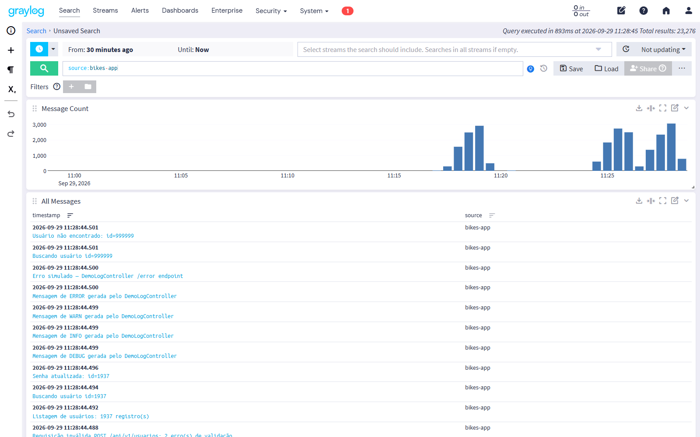
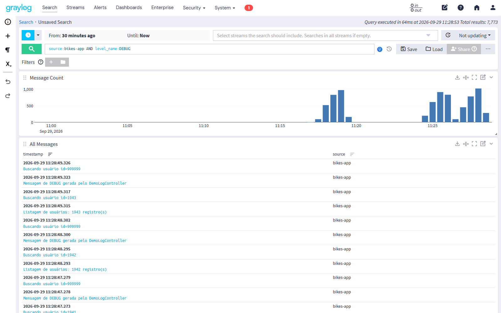
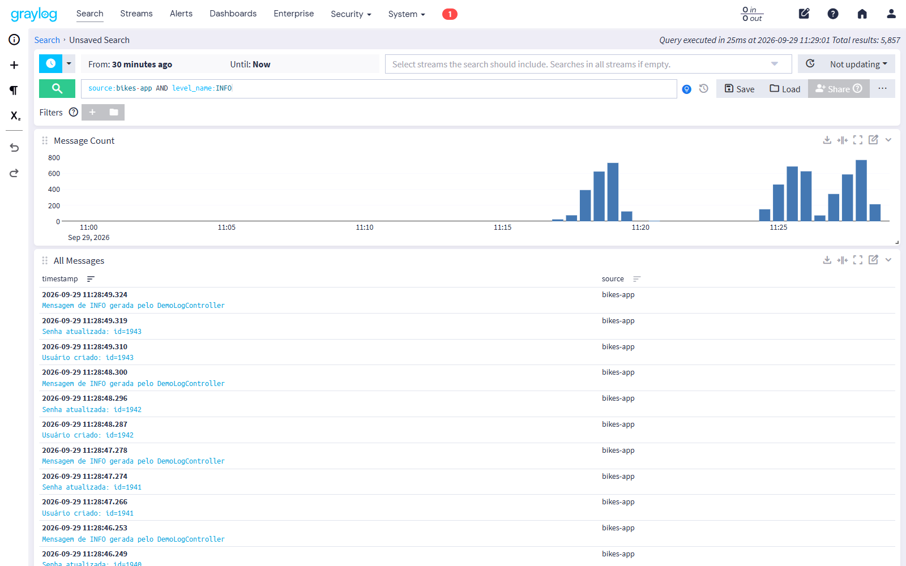
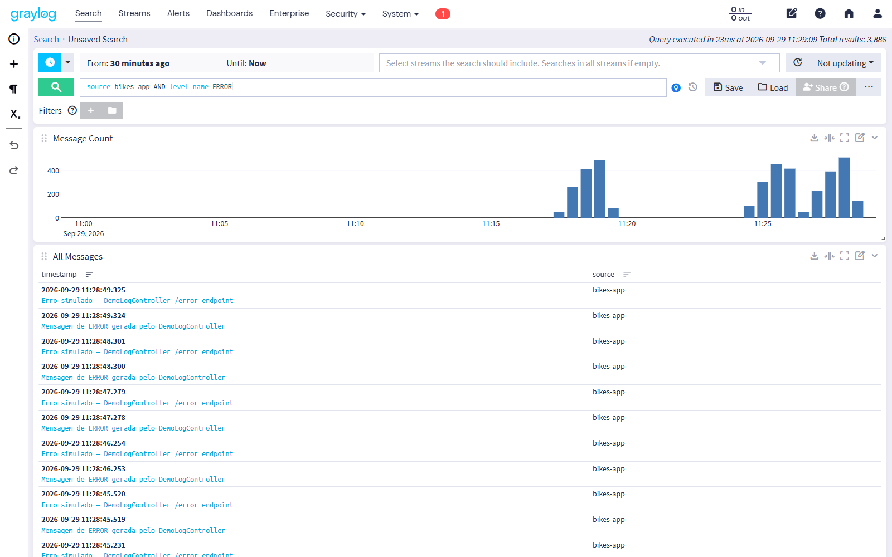
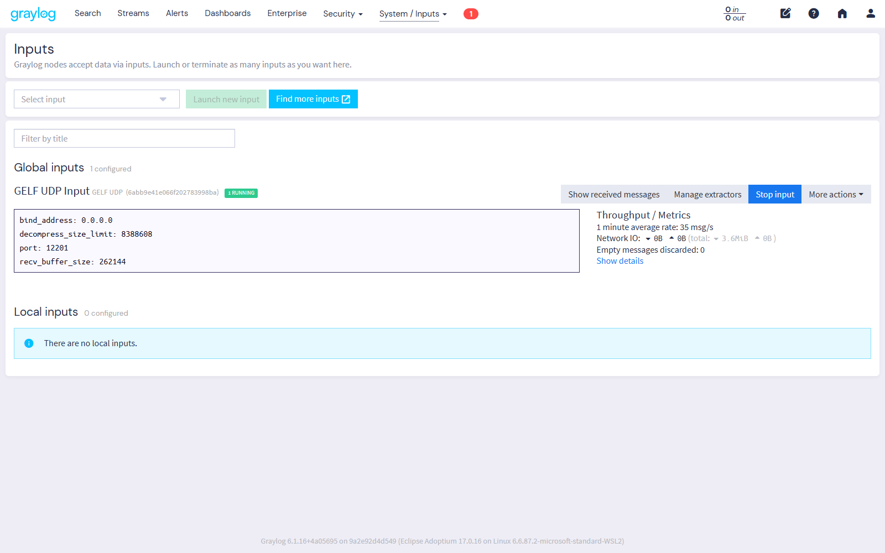

---

## 🔧 Decisões técnicas

1. **Healthchecks reais + `depends_on: condition`** — `depends_on` simples só espera o container iniciar. OpenSearch e Graylog levam de 60 a 120 s para aceitar conexões, então cada serviço tem um healthcheck de verdade (`mysqladmin ping`, `mongosh ping`, `/_cluster/health`, `/api/system/lbstatus`, `/actuator/health`, `/-/healthy`, `/api/health`) com `start_period` generoso. É isso que garante a subida "de primeira".
2. **Biblioteca GELF `de.siegmar:logback-gelf`** em vez de `logstash-gelf` ou do driver GELF do Docker: é compatível com o Logback 1.5.x do Spring Boot 4, não traz dependências extras e envia via UDP (não trava a app se o Graylog cair). O driver de log do Docker impediria o container de iniciar sem o Graylog pronto.
3. **Input GELF via init container**, não via content pack: o formato de content pack legado não é aceito pelo Graylog 6.x. O arquivo [graylog/contentpacks/gelf-udp-input.json](graylog/contentpacks/gelf-udp-input.json) fica só como referência.
4. **Limites de memória** para rodar em notebook de 8 GB: OpenSearch com heap de 512 MB (limite 1,5 GB), Graylog com 512 MB (limite 2 GB), MySQL com `innodb-buffer-pool-size=64M`, MongoDB com cache de 0,25 GB. Consumo total em repouso: ~2,5–3 GB.
5. **Portas internas**: MySQL, MongoDB e OpenSearch não são publicados no host. Isso reduz a superfície de ataque e evita conflito com serviços locais.
6. **Segurança da aplicação**:
   - console H2 desabilitado em runtime;
   - Actuator expõe apenas `health`, `info` e `prometheus`;
   - o e-mail do usuário (PII) **não** é gravado em log, só o id;
   - telemetria do Graylog desligada (`GRAYLOG_TELEMETRY_ENABLED=false`).
7. **Testes independentes da infraestrutura**: nos testes, H2 em memória substitui o MySQL e um `logback-test.xml` só com console substitui o GELF. Assim a esteira roda sem Docker e sem Graylog.
8. **`.env` versionado de propósito**: contém apenas valores do ambiente de avaliação (senha `admin` do Graylog, senha do MySQL local), necessários para o `docker compose up` funcionar sem nenhum passo manual. Em produção esses valores viriam de um cofre de segredos.
9. **Sincronização com o projeto base**: o código de domínio segue o repositório da disciplina (validação, `ApiExceptionHandler`, SpringDoc). As adições deste trabalho (Actuator, Micrometer, GELF, variáveis `DB_*`) ficam isoladas no `pom.xml` e no `application.properties`. A versão do `spring-boot-starter-validation` é gerenciada pelo parent, para evitar misturar uma versão milestone com o Boot 4.1.1.

---

## ✅ Testes automatizados

9 testes executados pela esteira (`./mvnw verify`):

| Classe | O que valida |
|--------|--------------|
| `BikesApplicationTests` | Contexto Spring sobe |
| `UsuarioControllerTest` | `201` na criação, `422` com erros por campo, `200`/`404` na busca, `200` no PATCH, listagem |
| `ObservabilidadeTest` | `/actuator/health` = `UP` e `/actuator/prometheus` expõe métricas da JVM (contrato usado pelo compose e pelo Prometheus) |

Rodar localmente sem instalar Java:

```bash
docker run --rm -v "$PWD":/ws -w /ws maven:3.9.16-eclipse-temurin-25-alpine mvn -B verify
```

---

## 📁 Estrutura do repositório

```
.
├── Dockerfile                          # multistage: build (JDK+Maven) → runtime (JRE)
├── docker-compose.yml                  # stack completa (app + observabilidade + bancos)
├── .env                                # variáveis do ambiente de avaliação
├── .github/workflows/ci-cd.yml         # esteira GitHub Actions
├── .gitlab-ci.yml                      # esteira equivalente (GitLab)
├── prometheus/prometheus.yml           # scrape da aplicação
├── grafana/provisioning/
│   ├── datasources/prometheus.yml      # datasource provisionado
│   └── dashboards/                     # provider + dashboard JSON
├── graylog/init-gelf-input.sh          # cria o input GELF via API (idempotente)
├── loadtest/script.js                  # carga k6 (perfil "loadtest")
├── docs/evidencias/                    # prints usados neste README
└── src/
    ├── main/java/br/edu/ifc/bikes/     # config, dto, entity, repository, service, web
    ├── main/resources/                 # application.properties, logback-spring.xml (GELF)
    └── test/                           # testes + H2 + logback-test.xml
```

---

## 🎯 Mapeamento da rubrica

| Critério | Pontos | Onde está |
|----------|--------|-----------|
| **0. Multistage Build** | Eliminatório | [Dockerfile](Dockerfile) · verificado também na esteira |
| **1. Pipeline CI/CD** | 2,5 | [ci-cd.yml](.github/workflows/ci-cd.yml) · testes → build → scan → push GHCR · [evidências](#evidências) |
| **2. Orquestração Docker Compose** | 2,0 | [docker-compose.yml](docker-compose.yml) · healthchecks + `depends_on` + init container |
| **3. Monitoramento de métricas** | 1,5 | Actuator/Micrometer no [pom.xml](pom.xml) · [prometheus.yml](prometheus/prometheus.yml) · print dos targets |
| **4. Observabilidade e Grafana** | 1,5 | [grafana/provisioning](grafana/provisioning/) · heap, CPU, RPS, contagem e tempo por status · prints |
| **5. Gestão de logs com Graylog** | 1,5 | [logback-spring.xml](src/main/resources/logback-spring.xml) · [init-gelf-input.sh](graylog/init-gelf-input.sh) · prints DEBUG/INFO/ERROR |
| **6. Documentação e README** | 1,0 | Este arquivo · [docs/evidencias/](docs/evidencias/) |

---

## 🔥 Troubleshooting

**OpenSearch falha com `max virtual memory areas vm.max_map_count [65530] is too low`** (Windows/WSL2):

```bash
wsl -d docker-desktop -u root -- sysctl -w vm.max_map_count=262144
```

Para persistir, adicione ao `%USERPROFILE%\.wslconfig` e rode `wsl --shutdown`:

```ini
[wsl2]
kernelCommandLine = "sysctl.vm.max_map_count=262144"
```

**Porta ocupada (8080, 9090, 3000, 9000)**: identifique o processo com `netstat -ano | findstr :8080` (Windows) ou `lsof -i :8080` (Linux/macOS), encerre-o ou altere a porta no `docker-compose.yml`.

**Containers com `OOMKilled`**: aumente a memória do Docker Desktop (Settings → Resources → Memory) para 6–8 GB.

**Dashboard sem dados**: gere tráfego com `docker compose --profile loadtest up loadtest` e confira se o target `bikes-app` está `UP` em http://localhost:9090/targets.

---

## 👥 Equipe

| Integrante | Responsabilidade |
|------------|------------------|
| Willighan | Pipeline CI/CD (GitHub Actions + GHCR) |
| Lucas | Prometheus + Grafana |
| Victor | Graylog, docker-compose e documentação |
